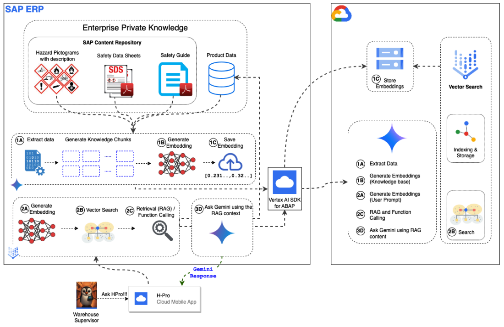

# ABAP SDK for Google Cloud and Vertex AI: A Quick Hands-On Guide

## Overview

This guide will help you leverage the power of Google Cloud's Vertex AI and Gemini to enhance your SAP environment using the ABAP SDK for Google Cloud and the Vertex AI SDK for ABAP. 

Please download the PDF guide from this [link](/hpro-guide/[Guide]%20Vertex%20AI%20SDK%20for%20ABAP.pdf).

**What is the Vertex AI SDK for ABAP?**

The Vertex AI SDK for ABAP is a component built on top of the ABAP SDK for Google Cloud. It is a toolkit that enables ABAP developers to seamlessly integrate Google Cloud AI services into their SAP applications. This opens up a wide range of possibilities, from automating tasks to gaining insights from your data. 

**Use Case: HAZMAT Pro**

This guide demonstrates the capabilities of the Vertex AI SDK for ABAP through a prototype application called **HAZMAT Pro**. HAZMAT Pro is an AI-powered solution designed to enhance warehouse safety and efficiency by providing real-time insights and guidance for handling hazardous materials.

It leverages Google Cloud's Vertex AI and Gemini to offer features such as:

  * Natural Language Interface for accessing HAZMAT information
  * Real-Time Information on safety data sheets and regulations
  * AI-Powered Pictogram Recognition for identifying hazard symbols
  * Inventory Integration with SAP systems for material-specific instructions
  * Emergency Response Guidance

**Application screencast:**

**What value will this guide provide?**

This guide empowers you to:

  * **Build RAG-capable applications:** Learn how to build applications that use Retrieval Augmented Generation (RAG) to enhance large language models (LLMs) with relevant external knowledge.

  * **Create contextual AI applications:** Develop applications that can answer user questions accurately, reliably, and with context.

  * **Unlock the potential of Google Cloud AI:** Explore the capabilities of Vertex AI and Gemini to enhance your SAP environment.

**Orchestration Architecture using ABAP**

This guide focuses on an orchestration architecture where ABAP serves as the central orchestrator for interacting with Google Cloud's Vertex AI. This approach offers several advantages:

*   **Leveraging Existing ABAP Expertise**: By using ABAP as the orchestrator, you can leverage your existing ABAP development skills and knowledge to build and deploy AI-powered applications.
*   **Seamless Integration with SAP Systems**: ABAP's tight integration with SAP systems allows for easy access to data and processes within your SAP landscape, simplifying the development of AI solutions that interact with your core business data and applications.
*   **Simplified Development Workflow**: The ABAP SDK provides a simplified development workflow, allowing you to focus on building the AI capabilities of your application without having to worry about the complexities of integrating with Google Cloud. 

By following the examples and instructions in this guide, you'll gain hands-on experience with this ABAP-centric orchestration approach, enabling you to build and deploy AI solutions that seamlessly integrate with your SAP environment. Following the architecture that you will enable.

**Who is this guide for?**

This guide is designed for ABAP developers interested in exploring Google Cloud AI services. Whether you are new to AI or an experienced developer, this guide will provide the knowledge and tools you need.

## Additional Resources

  * [Vertex AI SDK for ABAP](https://www.google.com/url?sa=E&source=gmail&q=https://www.google.com/url?sa=E%26source=gmail%26q=https://www.google.com/url?sa=E%26source=gmail%26q=https://www.google.com/url?sa=E%26source=gmail%26q=https://cloud.google.com/solutions/sap/docs/vertex-ai-sdk-for-abap)

  * [Gemini](https://www.google.com/url?sa=E&source=gmail&q=https://www.google.com/url?sa=E%26source=gmail%26q=https://www.google.com/url?sa=E%26source=gmail%26q=https://www.google.com/url?sa=E%26source=gmail%26q=https://cloud.google.com/ai/docs/generative-ai/learn/models)

  * [ABAP SDK for Google Cloud](https://www.google.com/url?sa=E&source=gmail&q=https://www.google.com/url?sa=E%26source=gmail%26q=https://www.google.com/url?sa=E%26source=gmail%26q=https://www.google.com/url?sa=E%26source=gmail%26q=https://github.com/GoogleCloudPlatform/abap-sdk-for-google-cloud)

**Note:** This repository is under active development. If you encounter any issues or have any suggestions, please feel free to open an issue or submit a pull request.